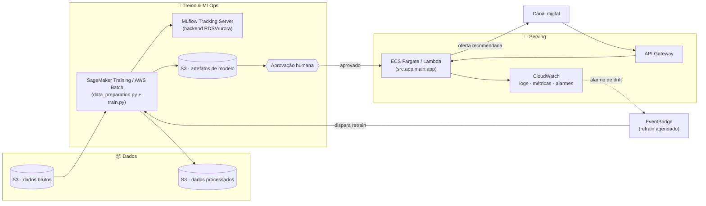

# 🎯 DATATHON POSTECH MLET - Plataforma Adaptativa de Ofertas Financeiras

## 📌 Problema de Negócio

Uma instituição financeira digital precisa decidir, para cada cliente elegível, se vale a pena oferecer um produto de campanha (depósito a prazo) por telemarketing. Regras fixas ou testes A/B longos desperdiçam contatos em clientes com baixa propensão e demoram a reagir a mudanças de contexto.

**Solução:** um sistema adaptativo com **Thompson Sampling contextual** (Multi-Armed Bandit bayesiano) que aprende, a partir do perfil de cada cliente, a probabilidade de aceitação e equilibra exploração/explotação automaticamente — em vez de uma política única e estática para toda a base.

---

## 🤖 Algoritmo

O projeto segmenta os clientes por contexto (**idade** + **profissão**, ~48 segmentos). Cada segmento mantém sua própria posterior **Beta(alpha, beta)** de taxa de aceitação, que se estreita conforme mais respostas chegam — assim a confiança e a recomendação mudam de cliente para cliente, e não é um número fixo repetido para toda a base.

**Priors testados** (registrados no MLflow): uninformativo `Beta(1,1)`, fracamente informado `Beta(2,16)` e fortemente informado `Beta(5,40)`, todos ancorados na taxa de aceitação histórica (~11%). O melhor no conjunto de teste é escolhido automaticamente. Thompson supera o Baseline em taxa de aceitação real entre os clientes recomendados (ver métricas abaixo).

---

## 📊 Base de Dados

- **Fonte:** [Kaggle - Bank Marketing (henriqueyamahata)](https://www.kaggle.com/datasets/henriqueyamahata/bank-marketing) — variante `bank-additional-full` do UCI Bank Marketing Dataset
- **Tamanho:** 41.188 registros × 21 colunas · **Target:** cliente assinou o depósito a prazo? (11.3% de aceitação, desbalanceado)
- **Vazamento removido:** a coluna `duration` (só conhecida após o contato) é descartada antes do treino
- **Dados sensíveis:** sem identificadores, renda, patrimônio, gênero ou raça — apenas atributos comportamentais/demográficos agregados; decisão apenas prioriza contato, nunca nega crédito

---

## 🚀 Como Usar

```bash
# 1. Setup
git clone https://github.com/Pedro642001/datathon-7mlet-grupo-15.git
cd datathon-7mlet-grupo-15
python -m venv venv && source venv/bin/activate  # Windows: venv\Scripts\activate
pip install -r requirements.txt

# 2. Baixar os dados (token em https://www.kaggle.com/settings/account)
kaggle datasets download -d henriqueyamahata/bank-marketing -p data/raw/
unzip -o data/raw/bank-marketing.zip -d data/raw/
# arquivo esperado: data/raw/bank_marketing.csv (separador ";")

# 3. Treinar (prepara dados, treina Baseline + Thompson, registra no MLflow, salva modelos)
python src/train.py

# 4. Subir a API
uvicorn src.app.main:app --reload
# Docs interativos em http://localhost:8000/docs

# 5. Rodar os testes
pytest tests/ -v

# 6. Rastrear experimentos
mlflow ui --backend-store-uri sqlite:///mlflow/mlflow.db
# Abrir em http://localhost:5000
```

Notebooks (`jupyter notebook`): `01_eda.ipynb` (análise exploratória), `02_baseline_thompson.ipynb` (treino, comparação e MLflow, reusa `src/train.py`) e `03_evaluation.ipynb` (métricas e Golden Set completo de 20 exemplos).

Exemplo de chamada à API:

```bash
curl -s -X POST "http://localhost:8000/api/v1/recommend" \
  -H "Content-Type: application/json" \
  -d '{"features": {"age":35, "job":"admin.", "marital":"married", "education":"secondary", "default":"no", "housing":"yes", "loan":"no", "contact":"cellular", "month":"may", "day_of_week":"mon", "campaign":1, "pdays":999, "previous":0, "poutcome":"unknown", "emp.var.rate":1.1, "cons.price.idx":93.994, "cons.conf.idx":-36.4, "euribor3m":4.857, "nr.employed":5191.0}}'
# {"recommended": 1, "confidence": 0.117, "feature_names_expected": [...]}
```

`models/*.json` e `mlflow/` (tracking + artefatos) já vêm versionados no repositório, então a API e o `mlflow ui` funcionam em um clone limpo mesmo antes de rodar `train.py` de novo.

---

## 🧪 Golden Set — 5 casos de teste

Amostra reduzida (dataset completo de 20 casos em `data/processed/golden_set.csv`):

| ID | Idade | Profissão     | Real (y) | Baseline Pred | Thompson Pred | Thompson Conf | Acerto |
|----|-------|---------------|----------|---------------|---------------|---------------|--------|
| 1  | 37    | admin.        | 1        | 1             | 1             | 0.117         | ✅     |
| 2  | 75    | retired       | 1        | 1             | 1             | 0.257         | ✅     |
| 3  | 42    | self-employed | 1        | 1             | 0             | 0.096         | ❌     |
| 4  | 66    | retired       | 1        | 1             | 1             | 0.257         | ✅     |
| 5  | 40    | technician    | 1        | 1             | 0             | 0.088         | ❌     |

A confiança do Thompson varia por segmento (25.7% para aposentados vs. 9.6% para autônomos) — reflete o contexto entrando na decisão, diferente do Baseline (11.3% fixo para todos).

---

## ☁️ Arquitetura-alvo em Nuvem (AWS)

Em produção, os dados brutos e processados ficariam em **S3** (camadas raw/processed), com o pipeline de preparação e o treino rodando como jobs agendados no **SageMaker Training** (ou **AWS Batch**/**ECS** para um projeto deste porte), registrando experimentos em um **MLflow Tracking Server** gerenciado (backend em **RDS**/**Aurora** em vez do SQLite local). Os artefatos de modelo seriam versionados no **S3** e promovidos via aprovação humana antes de ir para produção.

A API seria empacotada em container e servida via **ECS Fargate** ou **Lambda + API Gateway** atrás de um endpoint HTTPS, com autoscaling por volume de requisições. **CloudWatch** cobriria logs, métricas e alarmes de drift, e o **EventBridge** dispararia o retrain agendado quando novos dados chegassem ao S3. Estimativa de custo para volume pequeno/médio: baixo, dominado por Lambda/Fargate sob demanda e armazenamento S3.



---

## 📈 Métricas Observadas (conjunto de teste, prior weakly-informative)

| Métrica                                     | Baseline     | Thompson      |
|---------------------------------------------|--------------|---------------|
| Taxa de aceitação real (entre recomendados) | 11.3%        | 15.7%         |
| Clientes recomendados                       | 100% da base | 37.5% da base |

Ganho relativo de ~39% na taxa de aceitação, contatando bem menos clientes. Números exatos ficam registrados no MLflow e podem variar levemente a cada `python src/train.py` (Thompson Sampling é estocástico).

---

## 🔧 Tecnologias

Python 3.13 · Pandas / NumPy / SciPy · Scikit-learn · MLflow · FastAPI + Uvicorn · Jupyter · Pytest
