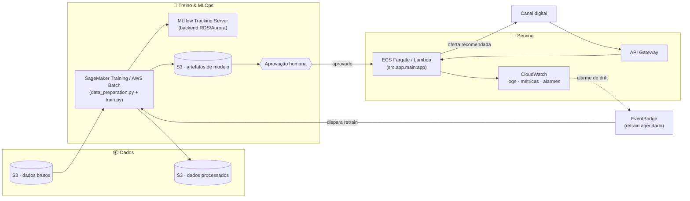

# 🎯 DATATHON POSTECH MLET - Plataforma Adaptativa de Ofertas Financeiras

## 📌 Problema de Negócio

Uma instituição financeira digital precisa decidir, para cada cliente elegível, se vale a pena oferecer um produto de campanha (depósito a prazo) por telemarketing. Regras fixas ou testes A/B longos desperdiçam contatos em clientes com baixa propensão e demoram a reagir a mudanças de contexto.

**Solução:** um sistema adaptativo com **Thompson Sampling contextual** (Multi-Armed Bandit bayesiano) que aprende, a partir do perfil de cada cliente, a probabilidade de aceitação e equilibra exploração/explotação automaticamente — em vez de uma política única e estática para toda a base.

---

## 🤖 Algoritmo

O projeto segmenta os clientes por contexto (**idade** + **profissão**, ~48 segmentos). Cada segmento mantém sua própria posterior **Beta(alpha, beta)** de taxa de aceitação, que se estreita conforme mais respostas chegam — assim a confiança e a recomendação mudam de cliente para cliente, e não é um número fixo repetido para toda a base.

**Priors testados** (registrados no MLflow): uninformativo `Beta(1,1)`, fracamente informado `Beta(2,16)` e fortemente informado `Beta(5,40)`, todos ancorados na taxa de aceitação histórica (~11%). O melhor no conjunto de teste é escolhido automaticamente. Thompson supera o Baseline em taxa de aceitação real entre os clientes recomendados (ver métricas abaixo).

---

## 📊 Base de Dados

- **Fonte:** [Kaggle - Bank Marketing (henriqueyamahata)](https://www.kaggle.com/datasets/henriqueyamahata/bank-marketing) — variante `bank-additional-full` do UCI Bank Marketing Dataset
- **Tamanho:** 41.188 registros × 21 colunas · **Target:** cliente assinou o depósito a prazo? (11.3% de aceitação, desbalanceado)
- **Vazamento removido:** a coluna `duration` (só conhecida após o contato) é descartada antes do treino
- **Dados sensíveis:** sem identificadores, renda, patrimônio, gênero ou raça — apenas atributos comportamentais/demográficos agregados; decisão apenas prioriza contato, nunca nega crédito

---

## 🚀 Como Usar

```bash
# 1. Setup
git clone https://github.com/Pedro642001/datathon-7mlet-grupo-15.git
cd datathon-7mlet-grupo-15
python -m venv venv && source venv/bin/activate  # Windows: venv\Scripts\activate
pip install -r requirements.txt

# 2. Baixar os dados (token em https://www.kaggle.com/settings/account)
kaggle datasets download -d henriqueyamahata/bank-marketing -p data/raw/
unzip -o data/raw/bank-marketing.zip -d data/raw/
# o zip traz bank-additional-full.csv (41.188 linhas, separador ";") e bank-additional-names.txt

# 3. Treinar (prepara dados, treina Baseline + Thompson, registra no MLflow, salva modelos)
python src/train.py

# 4. Subir a API
uvicorn src.app.main:app --reload
# Docs interativos em http://localhost:8000/docs

# 5. Rodar os testes
pytest tests/ -v

# 6. Rastrear experimentos
mlflow ui --backend-store-uri sqlite:///mlflow/mlflow.db
# Abrir em http://localhost:5000
```

Notebooks (`jupyter notebook`): `01_eda.ipynb` (análise exploratória), `02_baseline_thompson.ipynb` (treino, comparação e MLflow, reusa `src/train.py`) e `03_evaluation.ipynb` (métricas e Golden Set completo de 20 exemplos).

Exemplo de chamada à API — cliente aposentado de 66 anos (segmento de alta propensão):

```bash
curl -s -X POST "http://localhost:8000/api/v1/recommend" \
  -H "Content-Type: application/json" \
  -d '{"features": {"age":66, "job":"retired", "marital":"married", "education":"university.degree", "default":"no", "housing":"yes", "loan":"no", "contact":"cellular", "month":"may", "day_of_week":"mon", "campaign":1, "pdays":999, "previous":0, "poutcome":"nonexistent", "emp.var.rate":1.1, "cons.price.idx":93.994, "cons.conf.idx":-36.4, "euribor3m":4.857, "nr.employed":5191.0}}'
# {"recommended": 1, "confidence": 0.257, "feature_names_expected": [...]}
```

Trocando apenas idade e profissão para um operário de 45 anos, a decisão se inverte:

```bash
curl -s -X POST "http://localhost:8000/api/v1/recommend" \
  -H "Content-Type: application/json" \
  -d '{"features": {"age":45, "job":"blue-collar", "marital":"married", "education":"university.degree", "default":"no", "housing":"yes", "loan":"no", "contact":"cellular", "month":"may", "day_of_week":"mon", "campaign":1, "pdays":999, "previous":0, "poutcome":"nonexistent", "emp.var.rate":1.1, "cons.price.idx":93.994, "cons.conf.idx":-36.4, "euribor3m":4.857, "nr.employed":5191.0}}'
# {"recommended": 0, "confidence": 0.060, "feature_names_expected": [...]}
```

São os mesmos dados de campanha e macroeconômicos nos dois casos — só o segmento
(idade + profissão) muda, e com ele a posterior Beta consultada. É isso que
diferencia a política adaptativa do Baseline, que responderia 11,3% para os dois.

> Os valores categóricos aceitos são os da própria base (`data/processed/encoders.json`):
> `education` vai de `basic.4y` a `university.degree`, e `poutcome` é `failure`,
> `nonexistent` ou `success`. Como a recomendação é amostrada da posterior
> (`theta ~ Beta`), chamadas repetidas para um cliente no limiar podem alternar —
> é o mecanismo de exploração do Thompson Sampling, não instabilidade. Nos dois
> perfis acima a posterior está longe do limiar, então a resposta é estável.

`models/*.json` e `mlflow/` (tracking + artefatos) já vêm versionados no repositório, então a API e o `mlflow ui` funcionam em um clone limpo mesmo antes de rodar `train.py` de novo.

---

## 🧪 Golden Set — 5 casos de teste

Amostra reduzida — 3 clientes que aceitaram e 2 que rejeitaram, para cobrir os dois desfechos (conjunto completo de 20 casos em `data/processed/golden_set.csv`):

| ID | Idade | Profissão     | Real (y) | Baseline Pred | Thompson Pred | Thompson Conf | Baseline | Thompson |
|----|-------|---------------|----------|---------------|---------------|---------------|----------|----------|
| 1  | 37    | admin.        | 1        | 1             | 1             | 0.117         | ✅       | ✅       |
| 2  | 75    | retired       | 1        | 1             | 1             | 0.257         | ✅       | ✅       |
| 3  | 42    | self-employed | 1        | 1             | 0             | 0.096         | ✅       | ❌       |
| 11 | 41    | technician    | 0        | 1             | 0             | 0.088         | ❌       | ✅       |
| 12 | 28    | blue-collar   | 0        | 1             | 0             | 0.078         | ❌       | ✅       |

**Baseline 3/5 · Thompson 4/5.** No conjunto completo de 20 casos, Baseline acerta 10/20 e Thompson 14/20.

Duas leituras importam aqui. A confiança do Thompson varia por segmento (25.7% para aposentados vs. 7.8% para operários) — é o contexto entrando na decisão, enquanto o Baseline responde 11.3% para todo mundo. E o cliente 3 mostra o limite honesto do modelo: um autônomo de 42 anos que aceitou a oferta, mas cujo segmento tem propensão histórica baixa (9.6%), então o Thompson deixou de ofertar. Como a segmentação usa só idade e profissão, casos que fogem ao padrão do segmento continuam escapando — a análise de erros completa está em `03_evaluation.ipynb`.

---

## ☁️ Arquitetura-alvo em Nuvem (AWS)

Em produção, os dados brutos e processados ficariam em **S3** (camadas raw/processed), com o pipeline de preparação e o treino rodando como jobs agendados no **SageMaker Training** (ou **AWS Batch**/**ECS** para um projeto deste porte), registrando experimentos em um **MLflow Tracking Server** gerenciado (backend em **RDS**/**Aurora** em vez do SQLite local). Os artefatos de modelo seriam versionados no **S3** e promovidos via aprovação humana antes de ir para produção.

A API seria empacotada em container e servida via **ECS Fargate** ou **Lambda + API Gateway** atrás de um endpoint HTTPS, com autoscaling por volume de requisições. **CloudWatch** cobriria logs, métricas e alarmes de drift, e o **EventBridge** dispararia o retrain agendado quando novos dados chegassem ao S3. Estimativa de custo para volume pequeno/médio: baixo, dominado por Lambda/Fargate sob demanda e armazenamento S3.



---

## 📈 Métricas Observadas (conjunto de teste, prior weakly-informative)

Conjunto de teste com 12.357 clientes, dos quais 1.392 aceitariam a oferta. Os números abaixo são os do run `thompson-weakly-informative` registrado no MLflow — dá para conferir cada um com `mlflow ui`.

| Métrica                                     | Baseline     | Thompson      |
|---------------------------------------------|--------------|---------------|
| Taxa de aceitação real (entre recomendados) | 11.3%        | 15.7%         |
| Clientes contatados                         | 12.357 (100%)| 4.629 (37.5%) |
| Conversões obtidas                          | 1.392        | 726           |
| Contatos por conversão                      | 8.9          | 6.4           |

### O que esses números significam para a operação

A leitura ingênua ("+39% na taxa de aceitação") esconde o trade-off real: **o Thompson abre mão de 666 conversões**, porque deixa de contatar 62,5% da base e com isso alcança 52% de quem teria aceitado. Comparar 15,7% contra 11,3% sem dizer isso seria comparar coisas diferentes.

A comparação honesta fixa o orçamento de contatos. Contatando os **mesmos 4.629 clientes** de forma aleatória, o Baseline entregaria 521 conversões (a taxa histórica de 11,3% não muda com a amostra); o Thompson entrega 726. **Com o mesmo esforço de operação, são ~39% mais conversões** — e é daí que o ganho realmente vem, não da comparação com a campanha de base inteira.

O mesmo efeito pelo lado do custo: o Baseline precisa de 8,9 contatos para cada conversão, o Thompson precisa de 6,4 — **redução de 28% no custo por aquisição**, seja qual for o custo unitário da ligação.

Isso define quando a política adaptativa vale a pena. Se a operação é limitada por capacidade de contato (o caso usual em telemarketing, onde a equipe consegue ligar para um número fixo de clientes por dia), o Thompson é claramente melhor: mesma capacidade, mais conversões. Se a meta for volume absoluto de vendas e não houver restrição de custo por contato, o Baseline de contatar todo mundo ainda captura mais conversões em termos absolutos — e a resposta seria usar o Thompson para **priorizar a fila** de contatos, não para cortá-la.

Os valores variam levemente a cada `python src/train.py`, já que o Thompson Sampling amostra da posterior.

---

## ⚠️ Limitações Conhecidas

**Escopo da decisão.** O modelo decide *se* vale contatar um cliente, não *qual* de várias ofertas apresentar — são dois braços (ofertar / não ofertar), não um catálogo. A base escolhida traz uma única campanha (depósito a prazo) com a conversão já observada, e a Etapa 2 do desafio permite usá-la diretamente. Para múltiplas ofertas, a mesma estrutura de posterior por segmento se estenderia a uma posterior por (segmento, oferta).

**Segmentação rasa.** O contexto é só idade + profissão (48 segmentos). Dois clientes com histórico de campanha muito diferente, mas mesma faixa etária e profissão, recebem a mesma confiança — é a causa dos erros analisados em `03_evaluation.ipynb`. Um bandit linear contextual usaria todas as features.

**Modelo e scaler são acoplados.** A chave de segmento é derivada dos valores já normalizados (`ThompsonSampler._segment_key`). Se `data_preparation.py` for reexecutado com outro split, o `scaler` muda, as chaves deixam de bater com as salvas em `models/thompson.json` e a API passa a responder com o prior — **sem erro nenhum**. Na prática: `scaler.pkl` e `models/*.json` precisam ser sempre regenerados juntos. Em produção isso exigiria versionar os dois com um identificador comum e validar na carga.

**Categoria desconhecida não é rejeitada.** `ModelService.prepare_features` mapeia um valor categórico fora do vocabulário para o índice 0 e apenas registra um warning, em vez de devolver 422. A API responde com uma recomendação silenciosamente baseada em outra categoria.

**Avaliação é offline.** O ganho é medido reproduzindo decisões sobre respostas já coletadas. Um bandit real aprende com o próprio tráfego que direciona, o que gera viés de feedback — a estimativa offline não substitui um teste controlado em produção.

---

## 🔧 Tecnologias

Python 3.13 · Pandas / NumPy / SciPy · Scikit-learn · MLflow · FastAPI + Uvicorn · Jupyter · Pytest
