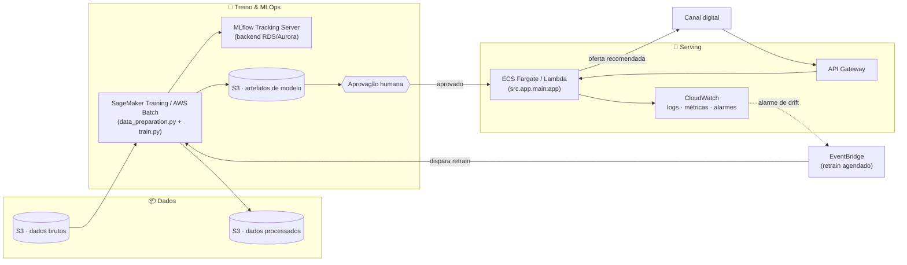

# 🎯 DATATHON POSTECH MLET - Plataforma Adaptativa de Ofertas Financeiras

## 📌 Problema de Negócio

Uma instituição financeira digital precisa decidir, para cada cliente elegível, se vale a pena oferecer um produto de campanha (no caso, um depósito a prazo) por telemarketing. Regras fixas ou testes A/B longos desperdiçam contatos em clientes com baixa propensão e demoram a reagir a mudanças de contexto.

**Solução:** um sistema adaptativo usando **Thompson Sampling contextual** (Multi-Armed Bandit bayesiano) que aprende, a partir do perfil de cada cliente, a probabilidade de aceitação e equilibra exploração/explotação automaticamente — em vez de uma política única e estática para toda a base.

---

## 🤖 Algoritmo: Thompson Sampling Contextual

Diferente de um bandit "cego" com um único par de parâmetros global, este projeto segmenta os clientes por contexto (**idade** + **profissão**) em ~48 segmentos de comportamento. Cada segmento mantém sua própria posterior **Beta(alpha, beta)** de taxa de aceitação:

1. **Explora**: nos primeiros contatos de um segmento, a incerteza é alta e a amostragem da Beta varia bastante.
2. **Explota**: conforme mais respostas chegam, a posterior de cada segmento se estreita em torno da taxa real observada.
3. **Contexto na decisão**: a confiança reportada — e a própria recomendação — muda de cliente para cliente conforme o segmento, não é um número fixo repetido para toda a base.

**Priors testados** (registrados no MLflow, ver Etapa MLOps): uninformativo `Beta(1,1)`, fracamente informado `Beta(2,16)` e fortemente informado `Beta(5,40)`, todos ancorados na taxa de aceitação histórica (~11%). O melhor no conjunto de teste é escolhido automaticamente.

**Resultado observado:** Thompson supera o Baseline em taxa de aceitação real entre os clientes recomendados (ver Etapa 3 abaixo), concentrando o esforço de contato nos clientes de maior propensão estimada.

---

## 📊 Base de Dados

- **Fonte:** [Kaggle - Bank Marketing (henriqueyamahata)](https://www.kaggle.com/datasets/henriqueyamahata/bank-marketing)
- **Origem:** variante `bank-additional-full` do UCI Bank Marketing Dataset (campanhas de telemarketing de um banco português)
- **Tamanho:** 41.188 registros × 21 colunas
- **Target (`y`):** cliente assinou o depósito a prazo? (yes/no) — 11.3% de taxa de aceitação, dataset desbalanceado
- **Features:** idade, profissão, estado civil, escolaridade, situação de crédito/financiamento, canal e mês de contato, histórico de campanhas anteriores, indicadores macroeconômicos (`emp.var.rate`, `cons.price.idx`, `cons.conf.idx`, `euribor3m`, `nr.employed`)
- **Vazamento removido:** a coluna `duration` (duração da ligação, só conhecida após o contato) é descartada antes do treino
- **Dados sensíveis:** não há identificadores de cliente, renda, patrimônio, gênero ou raça — apenas atributos comportamentais/demográficos agregados; nenhuma decisão automatizada é usada para negar crédito, apenas para priorizar contato

---

## 📂 Estrutura do Projeto

```
.
├── README.md                    # Este arquivo (documentação consolidada)
├── LICENSE                      # MIT
├── requirements.txt             # Dependências Python (versões fixas)
├── notebooks/                   # Jupyter notebooks
│   ├── 01_eda.ipynb             # Análise exploratória
│   ├── 02_baseline_thompson.ipynb  # Treino, comparação e MLflow
│   └── 03_evaluation.ipynb      # Métricas e Golden Set
├── src/                         # Código Python
│   ├── data_preparation.py      # ETL (limpeza, encoding, split, scaler)
│   ├── recommender.py           # Baseline + Thompson Sampling contextual
│   ├── train.py                 # Pipeline de treino + MLflow (fonte única, usado pelo notebook 02)
│   ├── utils.py                 # Wrappers de compatibilidade
│   └── app/                     # FastAPI modular (controllers, services, schemas)
│       └── main.py              # Entrypoint: `src.app.main:app`
├── tests/                       # Testes automatizados (pytest)
├── scripts/                     # Scripts de conveniência (subir a API, teste manual)
├── data/
│   ├── raw/                     # Dataset bruto do Kaggle (gitignored — baixar)
│   └── processed/               # Derivado de data/raw (train/test só localmente;
│                                 # scaler/encoders/feature_names/golden_set versionados)
├── models/                      # Modelos treinados em JSON (versionado)
└── mlflow/                      # Tracking de experimentos MLflow (versionado, ver seção abaixo)
    ├── mlflow.db                # Metadados: params, métricas, tags de cada run
    └── mlruns/                  # Artefatos: os models/*.json logados em cada run
```

Os gráficos de comparação e convergência ficam embutidos diretamente na saída de `notebooks/02_baseline_thompson.ipynb` (visíveis até no GitHub, sem precisar rodar nada) — por isso não há uma pasta separada de imagens.

---

## 🚀 Como Usar

### 1. Setup

```bash
git clone <url>
cd <repo>

python -m venv venv
source venv/bin/activate  # Linux/Mac
# ou
venv\Scripts\activate     # Windows

pip install -r requirements.txt
```

### 2. Baixar os dados

```bash
# Configurar Kaggle API (gerar token em https://www.kaggle.com/settings/account)
kaggle datasets download -d henriqueyamahata/bank-marketing -p data/raw/
unzip -o data/raw/bank-marketing.zip -d data/raw/
```

O arquivo esperado é `data/raw/bank_marketing.csv` (separador `;`). Se o zip do Kaggle extrair com outro nome, renomeie para esse.

### 3. Treinar (prepara os dados, treina, registra no MLflow e salva os modelos)

```bash
python src/train.py
```

Isso roda `src/data_preparation.py` automaticamente se `data/processed/train_clean.csv`/`test_clean.csv` ainda não existirem, treina o Baseline e as 3 configurações de prior do Thompson, registra tudo no MLflow (`mlflow/mlflow.db`) e salva `models/baseline.json` e `models/thompson.json`.

Alternativamente, `notebooks/02_baseline_thompson.ipynb` faz o mesmo treino com gráficos de comparação e de convergência (exploração vs. explotação) — ele reusa exatamente as mesmas funções de `src/train.py`.

### 4. Explorar a análise

```bash
jupyter notebook
# 01_eda.ipynb               -> análise exploratória
# 02_baseline_thompson.ipynb -> treino, comparação Baseline vs Thompson, MLflow
# 03_evaluation.ipynb        -> métricas e Golden Set (20 + 5 exemplos)
```

### 5. Subir a API

```bash
uvicorn src.app.main:app --reload
# Docs interativos em http://localhost:8000/docs
```

### 6. Exemplos de uso da API (curl)

Payload com categorias em string — a API mapeia usando os encoders salvos em `data/processed/encoders.json`:

```bash
curl -s -X POST "http://localhost:8000/api/v1/recommend" \
  -H "Content-Type: application/json" \
  -d '{"features": {"age":35, "job":"admin.", "marital":"married", "education":"secondary", "default":"no", "housing":"yes", "loan":"no", "contact":"cellular", "month":"may", "day_of_week":"mon", "campaign":1, "pdays":999, "previous":0, "poutcome":"unknown", "emp.var.rate":1.1, "cons.price.idx":93.994, "cons.conf.idx":-36.4, "euribor3m":4.857, "nr.employed":5191.0}}'

# Resposta esperada
# {"recommended": 1, "confidence": 0.117, "feature_names_expected": ["age","job",...]}
```

Payload mínimo (features ausentes são preenchidas com 0):

```bash
curl -s -X POST "http://localhost:8000/api/v1/recommend" \
  -H "Content-Type: application/json" \
  -d '{"features": {"age":45, "job":"technician"}}'
```

### 7. Rodar os testes

```bash
pytest tests/ -v
```

### 8. Rastrear experimentos (MLflow)

```bash
mlflow ui --backend-store-uri sqlite:///mlflow/mlflow.db
# Abrir em http://localhost:5000
```

O MLflow guarda o registro de experimentos em duas partes, ambas dentro de `mlflow/` e versionadas no repositório:

- **`mlflow/mlflow.db`** — banco SQLite com os *metadados* de cada run: parâmetros (`alpha0`, `beta0`, ...), métricas (accuracy, taxa de aceitação, ...) e tags. É o que a UI acima lê para montar a tabela comparativa de runs.
- **`mlflow/mlruns/`** — os *artefatos* de cada run: o JSON do modelo treinado naquela execução, salvo via `mlflow.log_artifact`. Metadados e artefatos ficam em lugares diferentes por design do MLflow (a partir da v3, o backend baseado só em arquivos está em modo de manutenção, então metadados vão para um banco e artefatos continuam em disco).

Ambos são fixados explicitamente em `src/train.py` (`mlflow.set_tracking_uri(...)` + `artifact_location=...`), então funcionam igual em qualquer máquina, sem depender de configuração global do MLflow (por padrão o MLflow pode usar um backend diferente, definido em `~/.config/mlflow`).

---

## 🧪 Golden Set — 5 casos de teste

Amostra reduzida (dataset completo de 20 casos em `data/processed/golden_set.csv`, gerado por `notebooks/03_evaluation.ipynb`):

| ID | Idade | Profissão     | Real (y) | Baseline Pred | Baseline Conf | Thompson Pred | Thompson Conf | Thompson Acerto |
|----|-------|---------------|----------|---------------|---------------|---------------|---------------|-----------------|
| 1  | 37    | admin.        | 1        | 1             | 0.113         | 1             | 0.117         | ✅               |
| 2  | 75    | retired       | 1        | 1             | 0.113         | 1             | 0.257         | ✅               |
| 3  | 42    | self-employed | 1        | 1             | 0.113         | 0             | 0.096         | ❌               |
| 4  | 66    | retired       | 1        | 1             | 0.113         | 1             | 0.257         | ✅               |
| 5  | 40    | technician    | 1        | 1             | 0.113         | 0             | 0.088         | ❌               |

Note que `Baseline Conf` é sempre 11.3% (é a taxa global fixa da regra "sempre oferecer"), enquanto `Thompson Conf` varia por cliente — segmentos de aposentados (`retired`, idades mais altas) têm confiança bem maior (25.7%) do que autônomos (`self-employed`, 9.6%), refletindo o comportamento real do dataset (clientes mais velhos aceitam mais esse produto). Isso é o contexto entrando diretamente na decisão.

---

## ☁️ Arquitetura-alvo em Nuvem (AWS)

Em produção, os dados brutos e processados ficariam em **S3** (camadas raw/processed), com o pipeline de preparação (`src/data_preparation.py`) e o treino (`src/train.py`) rodando como jobs agendados no **SageMaker Training** (ou um job simples em **AWS Batch**/**ECS** para um projeto deste porte), registrando experimentos em um **MLflow Tracking Server** gerenciado (ou o próprio MLflow em modo servidor, com backend em **RDS**/**Aurora** em vez do SQLite local). Os artefatos de modelo (`models/*.json`) seriam versionados no **S3** e promovidos via um passo manual de aprovação, mantendo humano no loop antes de qualquer modelo novo ir para produção.

A API (`src.app.main:app`) seria empacotada em um container e servida via **ECS Fargate** ou **Lambda + API Gateway** atrás de um endpoint HTTPS, com autoscaling baseado em volume de requisições. **CloudWatch** cobriria logs, métricas de latência/erro e alarmes de drift (ex.: queda abrupta na taxa média de recomendação), e o **EventBridge** dispararia o retrain agendado (`python src/train.py`) quando novos dados de campanha chegassem ao S3. Estimativa de custo para um volume pequeno/médio (ordem de dezenas de milhares de recomendações/mês): baixo, dominado por Lambda/Fargate sob demanda e armazenamento S3, tipicamente algumas centenas de reais/mês nessa escala.



---

## 📈 Métricas Observadas (conjunto de teste, prior weakly-informative)

| Métrica                                     | Baseline     | Thompson      |
|---------------------------------------------|--------------|---------------|
| Taxa de aceitação real (entre recomendados) | 11.3%        | 15.7%         |
| Clientes recomendados                       | 100% da base | 37.5% da base |

Ganho relativo de ~39% na taxa de aceitação, contatando bem menos clientes — os números exatos de cada run ficam registrados no MLflow e podem variar levemente a cada `python src/train.py` porque o Thompson Sampling é estocástico por natureza.

---

## 🔧 Tecnologias

- **Python 3.13**
- **Pandas / NumPy / SciPy:** processamento de dados e distribuições Beta
- **Scikit-learn:** encoding e normalização
- **MLflow:** rastreamento de experimentos (backend SQLite local)
- **FastAPI + Uvicorn:** API de recomendação
- **Jupyter:** análise interativa
- **Pytest:** testes automatizados
